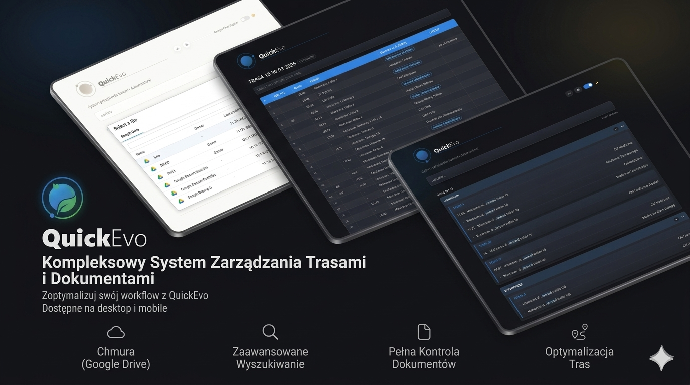

<p align="center">
  
</p>

# QuickEvo


Przeglądarkowe narzędzie do wyszukiwania i zarządzania danymi tras z plików Excel (.xlsx, .xls) oraz CSV.

---

## Krótki opis

QuickEvo to aplikacja PWA działająca w całości po stronie klienta w przeglądarce. Przetwarzanie plików, budowa indeksu wyszukiwania i przechowywanie danych odbywają się lokalnie z wykorzystaniem IndexedDB. Integracja z Google Drive umożliwia import dokumentów bezpośrednio z chmury.

---

## Architektura

- **Client-Side Only** — cała logika biznesowa działa w przeglądarce użytkownika
- **Modułowa struktura** — oddzielne pliki JS/CSS dla Google Drive, debuggera i testów
- **Shadow DOM** — debugger korzysta z izolowanego Shadow DOM, co zapobiega konfliktom stylów

---

## Funkcjonalności

### Wyszukiwanie

- Wyszukiwanie rozmyte (fuzzy matching) z wykorzystaniem odległości Levenshteina
- Predykcyjne podpowiedzi inline podczas pisania z nawigacją klawiaturą (Tab/strzałki)
- Ważony indeks danych (adresy → obiekty → trasy)
- Buforowanie wyników z LRU cache
- Wyniki pogrupowane według plików źródłowych
- Zwijane sekcje kategorii tras (STANDARD, WIECZOREK, SOBOTA, NIEDZIELA)
- Automatyczna normalizacja zapytań (ignorowanie polskich znaków diakrytycznych i wielkości liter)

### Import danych

- Lokalny import wielu plików jednocześnie (pliki Excel i CSV)
- Integracja z Google Drive (Picker API + OAuth2)
- Synchronizacja folderów z rekursywnym pobieraniem plików .xlsx
- Rozwiązywanie konfliktów przy synchronizacji
- Trwałe przechowywanie w IndexedDB (praca offline)

### Interfejs

- Animacje wejścia/wyjścia wyników z efektem staggered
- Obsługa reduced motion (wyłączenie animacji dla użytkowników z wrażliwością na ruch)
- Responsywny design z obsługą urządzeń mobilnych
- Ekran powitalny z efektem glassmorphism
- Ciemny motyw (domyślny) oraz motyw Matrix (cyberpunk)
- Przełączanie motywów z zachowaniem stanu

---

## Struktura projektu

```
QuickEvo/
├── index.html           # Główny dokument HTML
├── css/
│   ├── style.css        # Style główne (jasny/ciemny motyw)
│   └── matrix.css       # Styl motywu Matrix
├── js/
│   ├── app.js           # Logika aplikacji
│   ├── googleDrive.js   # Moduł integracji z Google Drive
│   ├── qe-debugger.js   # Moduł debuggera (Shadow DOM)
│   └── tests.js         # Pakiet testów automatycznych
└── README.md
```

---

## Schema IndexedDB

**Baza danych:** `quickevo_docs_v2`

**Magazyn `files`:**

| Pole | Typ | Opis |
|------|-----|------|
| `name` | String | Nazwa pliku (klucz główny) |
| `blob` | Blob | Surowa zawartość binarna |
| `size` | Number | Rozmiar w bajtach |
| `updatedAt` | Number | Timestamp ostatniej modyfikacji |

---

## Debugger i diagnostyka

Moduł `qe-debugger.js` udostępnia:

- Panel floating w prawym górnym rogu (Shadow DOM)
- Funkcja `window.logAction(action, payload, level)` do logowania zdarzeń
- Obiekt `window.QE_Debugger` z metodami: `open()`, `close()`, `toggle()`, `clear()`, `log()`, `benchmark()`
- Wbudowane testy automatyczne uruchamiane przez parametr URL (`?test=1`)

---

## Optymalizacje wydajności

- Bufor LRU dla wyników wyszukiwania i podpowiedzi predykcyjnych
- Porcjowanie renderowania z `requestAnimationFrame`
- Event delegation dla obsługi kliknięć na listach wyników
- `ResizeObserver`, `MutationObserver` i `IntersectionObserver` do wykrywania overflow
- Równoległy import z Google Drive z limitem 2 jednoczesnych połączeń
- Czyszczenie indeksu z pamięci RAM przy usuwaniu plików

---

## Obsługiwane przeglądarki

- Chrome 90+
- Firefox 88+
- Safari 14+
- Edge 90+

---

## Zasady projektowe

- Całe przetwarzanie odbywa się lokalnie w przeglądarce
- Brak zewnętrznych zależności (poza SheetJS do parsowania Excel)
- Izolacja komponentów przez Shadow DOM
- Semantyczny HTML z dostępnością (progress elements, viewport-fit)

---

## Stan projektu

Aktywny rozwój. Aktualna wersja: 2.0.0.
