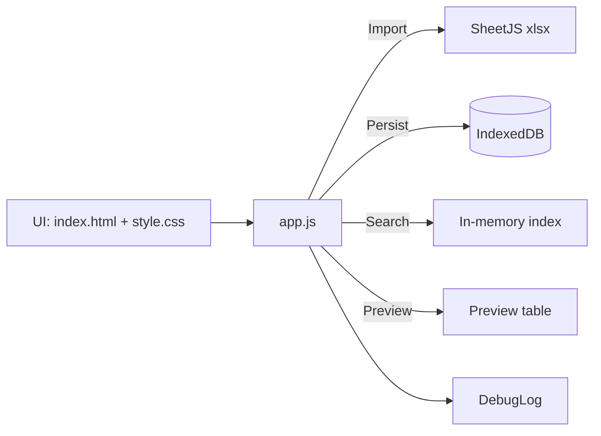

# QuickEvo


## Overview
QuickEvo to lekka aplikacja webowa (frontend-only) do szybkiego przeszukiwania tras i dokumentów na podstawie plików `.xlsx` i `.csv`. Umożliwia import plików, buduje indeks do wyszukiwania oraz pozwala podejrzeć zawartość arkuszy bezpośrednio w przeglądarce.

Aplikacja działa jako statyczna strona (bez backendu). Dane z importu są przechowywane lokalnie w przeglądarce (IndexedDB), dzięki czemu nie trzeba ponownie importować plików przy każdym uruchomieniu (dopóki nie wyczyścisz danych witryny / nie zmienisz profilu przeglądarki).

## Key Features
- [x] Import plików `.xlsx` / `.xls` / `.csv` (multi-import)
- [x] Drag & drop plików do okna aplikacji
- [x] Walidacja limitu rozmiaru (limit per plik)
- [x] Budowa indeksu wyszukiwania po imporcie
- [x] Wyszukiwanie tras (z debouncingiem)
- [x] Podgląd pliku (tabela + metadane)
- [x] Tryb jasny/ciemny (toggle)
- [x] Wbudowany DebugLog w prawym dolnym rogu
- [x] Działanie offline po imporcie (cache w IndexedDB)
- [x] Bezpieczniejszy CSP (Content Security Policy)
- [x] Import plików Excel z Google Drive (Picker API + GIS), ograniczony do dwóch folderów: GRAFIK/TRASY

## Tech Stack
- HTML + CSS
- JavaScript (Vanilla)
- [SheetJS/xlsx](https://github.com/SheetJS/sheetjs) (ładowany z CDN) do parsowania `.xlsx`
- IndexedDB do trwałego przechowywania importowanych plików w przeglądarce

## System Requirements
- Przeglądarka: aktualny Chrome / Edge / OperaGX / Firefox
- Zalecane uruchamianie przez lokalny serwer HTTP (a nie `file://`), aby uniknąć ograniczeń przeglądarki
- Opcjonalnie: Python 3 lub Node.js do uruchomienia lokalnego serwera

## Installation (step-by-step)
1. Sklonuj repozytorium lub pobierz katalog projektu.
2. Uruchom statyczny serwer HTTP w katalogu projektu.
   - Python:
     ```bat
     cd /d d:\Desktop\Projects\QuickEvo
     py -m http.server 3000
     ```
   - Node.js (alternatywnie, jeśli masz zainstalowane):
     ```bat
     npx http-server . -p 3000
     ```
3. Otwórz aplikację:
   - `http://localhost:3000/`

## Usage
### Import plików
1. Kliknij ikonę importu w prawym górnym rogu lub upuść pliki na stronę (drag & drop).
2. Wybierz pliki `.xlsx`/`.xls`/`.csv`.
3. Po imporcie aplikacja zbuduje indeks i włączy wyszukiwarkę.

### Import z Google Drive
1. Kliknij ikonę Google Drive obok importu lokalnego.
2. Zaloguj się / zaakceptuj dostęp (GIS), jeśli przeglądarka o to poprosi.
3. Wybierz pliki Excel tylko z folderów:
   - `GRAFIK` (ID: `10m4VzgbWqLy3U5V4lP_e-TN-vZVCyhGj`)
   - `TRASY` (ID: `1tyClIJEDwntOrYCMVYmyR5nR6LNHmN-x`)
4. Po imporcie pliki są zapisywane lokalnie w IndexedDB (jak przy imporcie z dysku).

### Wyszukiwanie
- Wpisz minimum 3 znaki w pole wyszukiwania.
- Kliknij wynik, aby otworzyć podgląd pliku i wiersza.

### Podgląd pliku
- Widok podglądu wyświetla tabelę pierwszego arkusza z pliku.
- Możesz wrócić do wyszukiwania przyciskiem „← Powrót do wyszukiwania”.

### DebugLog
- Panel w prawym dolnym rogu umożliwia podejrzenie zdarzeń aplikacji (np. import, nawigacja, błędy wczytywania).
- Zawiera wyszukiwarkę logów i kopiowanie do schowka.

## Directory Structure
```text
QuickEvo/
  index.html        # Strona aplikacji
  style.css         # Style UI
  app.js            # Logika aplikacji
  googleDrive.js    # Integracja Google Drive (GIS + Picker) dla importu Excela
  docs/             # (Opcjonalnie) przykładowe pliki .xlsx/.csv do bootstrapu
```

## Configuration / Environment Variables
Ta aplikacja nie wymaga zmiennych środowiskowych (brak backendu).
Jeśli hostujesz aplikację na serwerze, zadbaj o:
- poprawne serwowanie plików statycznych (HTML/CSS/JS),
- poprawne nagłówki MIME,
- zachowanie CSP zdefiniowanego w `index.html`.

### Konfiguracja Google Drive (Picker + GIS)
- Uzupełnij stałe `CLIENT_ID` oraz `API_KEY` w [googleDrive.js](file:///d:/Desktop/Projects/QuickEvo/googleDrive.js).
- W Google Cloud Console:
  - skonfiguruj OAuth Consent Screen dla aplikacji (External/Internal zależnie od organizacji),
  - dodaj do OAuth Client (Web) poprawne Authorized JavaScript origins (np. `http://localhost:3000` oraz domenę produkcyjną),
  - włącz API: Google Drive API (oraz Google Picker API, jeśli wymagane w Twoim projekcie),
  - ogranicz `API_KEY` (HTTP referrers) do docelowych originów.

## API
Brak publicznego API HTTP (frontend-only).

## Security Notes
- Projekt wykorzystuje Content Security Policy. Jeśli dodajesz zewnętrzne zasoby (CDN / API), zaktualizuj CSP w `index.html`.
- Importowane pliki są przechowywane lokalnie w przeglądarce (IndexedDB) i nie są wysyłane na serwer.
- Nie używaj i nie przechowuj w frontendzie OAuth client secret. Integracja Google Drive działa wyłącznie na `CLIENT_ID` (GIS) oraz `API_KEY` (Picker) i powinna mieć klucze ograniczone po stronie Google Cloud.

## Contributing (CONTRIBUTING)
1. Zrób fork repozytorium.
2. Utwórz branch: `feature/<nazwa>` lub `fix/<nazwa>`.
3. Zadbaj o brak ostrzeżeń CSP i brak logów konsolowych (wyjątek: wbudowany DebugLog).
4. Otwórz Pull Request z opisem zmian, screenami (jeśli UI) i krokami testowymi.

## Changelog
Na ten moment repozytorium nie zawiera formalnego CHANGELOG.
Zalecany format na przyszłość: [Keep a Changelog](https://keepachangelog.com/en/1.1.0/).

## License
TBD (do uzupełnienia przez właściciela repozytorium).

## Roadmap
- [ ] Integracja wyszukiwanych tras z grafikiem (planowane w przyszłych wersjach)
- [x] Import z Google Drive / integracje z chmurą (Picker + GIS)
- [ ] Ulepszenie indeksowania i metadanych plików (np. tagi, kategorie)

## Architecture (high-level)

