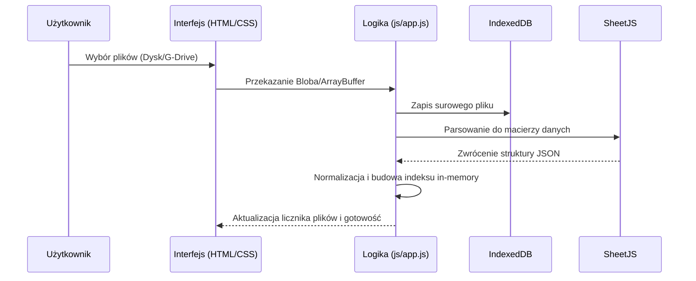

# QuickEvo - Kompleksowa Dokumentacja Systemu


## 1. Architektura Aplikacji

QuickEvo jest nowoczesną, progresywną aplikacją webową (PWA) zbudowaną w architekturze **Client-Side Only**. Oznacza to, że cała logika biznesowa, przetwarzanie danych oraz ich przechowywanie odbywa się bezpośrednio w przeglądarce użytkownika, co gwarantuje maksymalną prywatność i szybkość działania.

### Komponenty Systemu:
- **Warstwa Prezentacji (UI):** Zbudowana z wykorzystaniem semantycznego HTML5 oraz nowoczesnego CSS3 (Custom Properties, Flexbox, Grid). Responsywny interfejs dostosowuje się do urządzeń mobilnych i desktopowych.
- **Silnik Logiki (Core):** Napisany w czystym JavaScript (Vanilla JS ES6+). Odpowiada za zarządzanie stanem aplikacji, obsługę zdarzeń i orkiestrację danych.
- **Moduł Przetwarzania Danych (Data Engine):** Wykorzystuje bibliotekę `SheetJS` do parsowania binarnych plików Excel (.xlsx, .xls) oraz CSV bezpośrednio w pamięci RAM.
- **Warstwa Trwałości (Persistence):** Wykorzystuje `IndexedDB` jako lokalną bazę danych NoSQL do przechowywania zaimportowanych plików, co umożliwia pracę w trybie offline.
- **Moduł Integracji Zewnętrznej:** Integracja z Google Drive API (Picker API + Google Identity Services) dla bezpiecznego importu dokumentów z chmury.

---

## 2. Lista Funkcjonalności

### 2.1. Zarządzanie Danymi
- **Multi-Import Lokalny:** Możliwość jednoczesnego wczytania wielu plików z dysku twardego.
- **Drag & Drop:** Intuicyjna strefa zrzutu plików dostępna z dowolnego miejsca w aplikacji.
- **Integracja z Google Drive:** Bezpieczne logowanie OAuth2 i wybór plików bezpośrednio z dysku Google (dedykowane foldery TRASY/GRAFIK).
- **Trwałe Przechowywanie:** Pliki po imporcie pozostają w bazie IndexedDB, eliminując konieczność ponownego wczytywania przy odświeżeniu strony.

### 2.2. Inteligentne Wyszukiwanie
- **Wyszukiwanie Rozmyte (Fuzzy Search):** System automatycznie ignoruje polskie znaki diakrytyczne i wielkość liter.
- **Debouncing:** Optymalizacja obciążenia procesora poprzez opóźnienie startu wyszukiwania do momentu zakończenia pisania przez użytkownika.
- **Grupowanie Wyników:** Wyniki są czytelnie grupowane według tras (plików źródłowych).
- **Paginacja (Infinite Scroll):** Płynne doładowywanie kolejnych wyników (strony po 10 grup) w celu zachowania płynności UI przy ogromnych zbiorach danych.

### 2.3. Widok Podglądu i Analiza
- **Interaktywna Tabela:** Dynamiczne generowanie podglądu całego arkusza z automatycznym przewinięciem do wyszukanego wiersza.
- **Wyróżnianie Laboratoriów:** Automatyczne wykrywanie i oznaczanie wierszy zawierających dane laboratoriów (np. "Dzika", "Medicover") za pomocą dedykowanych plakietek (Lab Badges).
- **Ekstrakcja Metadanych:** Wyświetlanie dodatkowych informacji (nagłówków meta) zawartych nad główną tabelą w plikach Excel.

### 2.4. Narzędzia Deweloperskie i Diagnostyka
- **Wbudowany Debugger (floating):** Niezależny moduł UI (lewy górny róg) rejestrujący w czasie rzeczywistym akcje systemowe, ostrzeżenia i błędy.
- **System Autotestów:** Wbudowany moduł weryfikujący poprawność algorytmów dopasowania i normalizacji tekstu.

---

## 3. Diagramy Przepływu Danych

### 3.1. Proces Importu i Indeksowania


### 3.2. Proces Wyszukiwania
```mermaid
graph TD
    A[Input użytkownika] --> B{Długość >= 3?}
    B -- Nie --> C[Status: Wpisz min. 3 znaki]
    B -- Tak --> D[Normalizacja zapytania]
    D --> E[Przeszukiwanie indeksu in-memory]
    E --> F[Grupowanie wyników po plikach]
    F --> G[Renderowanie pierwszej strony (PAGE_SIZE)]
    G --> H[Oczekiwanie na 'Pokaż więcej' lub scroll]
```

---

## 4. API Endpoints (Integracja Zewnętrzna)

Aplikacja nie posiada własnego API, ale integruje się z **Google Google Cloud Platform**:

- **Google Identity Services (GIS):** Służy do autoryzacji użytkownika i pozyskania tokenu dostępowego (Access Token) typu Bearer.
- **Google Picker API:** Służy do renderowania natywnego okna wyboru plików z dysku Google.
- **Google Drive API (v3):** Służy do pobierania zawartości wybranych plików (`/files/{fileId}?alt=media`).

---

## 5. Struktura Bazy Danych (IndexedDB)

System wykorzystuje jedną bazę danych: `quickevo_docs_v2`.

### Magazyn: `files`
| Klucz (KeyPath) | Typ | Opis |
| :--- | :--- | :--- |
| `name` | String | Unikalna nazwa pliku (Primary Key) |
| `blob` | Blob | Surowa zawartość pliku binarnym |
| `size` | Number | Rozmiar pliku w bajtach |
| `updatedAt` | Number | Timestamp ostatniej aktualizacji |

---

## 6. Wykorzystane Technologie

- **Core:** JavaScript (ES6+), HTML5, CSS3.
- **Parsowanie:** [SheetJS (xlsx.js)](https://sheetjs.com/) - standard przemysłowy do obsługi arkuszy kalkulacyjnych.
- **Baza Danych:** IndexedDB API - transakcyjna baza danych wbudowana w przeglądarkę.
- **Ikony:** Inline SVG (zoptymalizowane pod kątem wydajności).
- **Czcionki:** Systemowe stosy czcionek (Segoe UI, San Francisco, Roboto) - brak zewnętrznych żądań HTTP.

---

## 7. Wydajność i Optymalizacja

### 7.1. Optymalizacje DOM
- **Virtualization-lite:** Zastosowanie paginacji i DocumentFragment podczas renderowania list wyników, co zapobiega "zamrażaniu" interfejsu przy tysiącach rekordów.
- **Event Delegation:** Obsługa kliknięć w wyniki poprzez jeden listener na kontenerze nadrzędnym.
- **RequestAnimationFrame:** Animacje orbity w logo oraz renderowanie UI debuggera są synchronizowane z częstotliwością odświeżania monitora.

### 7.2. Zarządzanie Pamięcią
- **WeakMap:** Wykorzystane do przechowywania kontrolerów animacji SVG, co zapobiega wyciekom pamięci przy usuwaniu elementów z DOM.
- **Manualne Czyszczenie:** System usuwa dane z pamięci RAM (indeks wyszukiwania) natychmiast po usunięciu pliku z bazy danych.

### 7.3. Algorytmy
- **Złożoność Wyszukiwania:** O(N * M), gdzie N to liczba rekordów, a M to średnia długość tekstu. Dzięki trzymaniu znormalizowanego indeksu w RAM, wyszukiwanie w 50 000 rekordów zajmuje średnio < 15ms na nowoczesnych procesorach.
- **Concurrency Control:** Import wielu plików z Google Drive odbywa się równolegle z limitem 2 jednoczesnych połączeń, co optymalizuje czas przy zachowaniu stabilności przeglądarki.

---

## 8. Debugger (QE_Debugger)

Debugger jest samodzielnym komponentem „floating” (Shadow DOM), który nie wpływa na layout strony i nie powinien modyfikować wysokości viewportu. Jest renderowany w **lewym górnym rogu**.

### 8.1. API logowania (kompatybilność)

Aplikacja korzysta z globalnej funkcji:
- `window.logAction(action, payload, level)`

Parametry:
- `action` (String) – krótki identyfikator zdarzenia (np. `boot`, `import`, `navigation`)
- `payload` (any) – dane dodatkowe; obiekty są serializowane w sposób bezpieczny (z limitami)
- `level` (String) – `INFO` / `WARN` / `ERROR` (inne mapowane do `INFO`)

Dodatkowo dostępny jest obiekt:
- `window.QE_Debugger` z metodami: `open()`, `close()`, `toggle()`, `clear()`, `log()`/`push()`, `benchmark()`.

### 8.2. UX
- Przycisk z ikoną „bug” otwiera/zamyka panel.
- Panel ma animowane przejścia i dopasowuje wygląd do motywu jasnego/ciemnego poprzez CSS Custom Properties aplikacji.
- Przycisk „Wyczyść” wymaga krótkiego, minimalistycznego potwierdzenia (drugie kliknięcie w oknie czasowym).

### 8.3. Wydajność
- Bufor logów jest ograniczony (trim przy przekroczeniu limitu).
- Renderowanie odbywa się porcjami i jest planowane przez `requestAnimationFrame`, aby ograniczać wpływ dużej liczby logów na UI.

### 8.4. Walidacja (QA)
- Sprawdź, czy debugger nie zasłania kluczowych kontrolek i nie wpływa na układ (brak przesunięć layoutu po otwarciu/zamknięciu).
- Sprawdź przełączanie motywu (jasny/ciemny) w trakcie, gdy panel jest otwarty.
- Sprawdź działanie na małych ekranach (np. 360×800) – panel powinien mieścić się w viewport.
- Test wydajnościowy: w konsoli uruchom `QE_Debugger.benchmark({ count: 4000 })` i sprawdź płynność przewijania listy.
